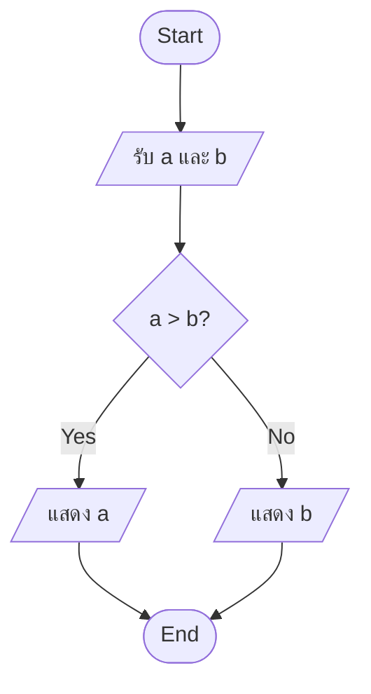
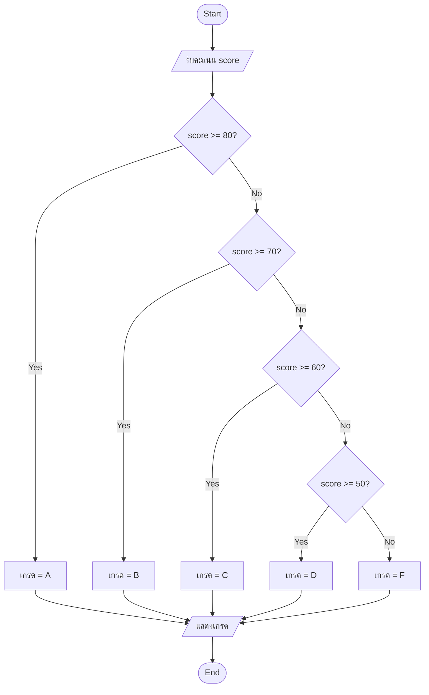
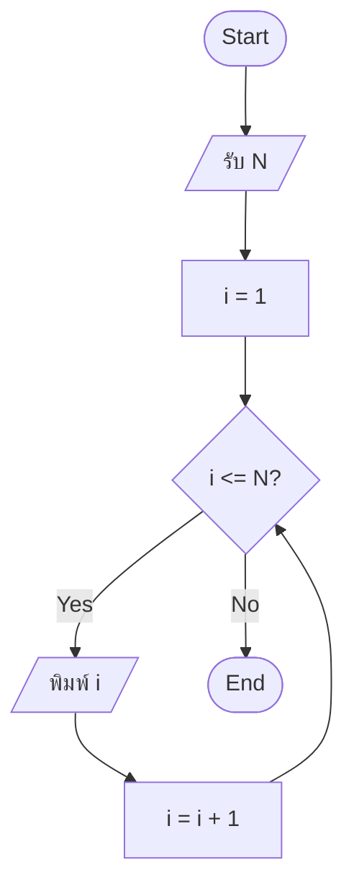

```mermaid
 flowchart TD 
Start([Start]) --> Input[/รับ a และ b/]
Input --> 67{a > b?}
67 -->|Yes| a[/แสดง a/] 
67 -->|No| b[/แสดง b/]
a & b --> Output([End])
```

```mermaid
flowchart TD
     start([Start]) --> Input[/รับคะแนน score/]
     Input --> D1{score >= 80?}
     D1 -->|Yes| A[เกรด = A]
     D1 -->|No| D2{score >= 70?}
     D2 -->|Yes| B[เกรด = B]
     D2 -->|No| D3{score >= 60?}
     D3 -->|Yes| C[เกรด = C]
     D3 -->|No| D4{score >= 50?}
     D4 -->|Yes| D[เกรด = D]
     D4 -->|No| F[เกรด = F]
     A & B & C & D & F --> Output[/แสดงเกรด/]
     Output --> End([End]) 
```

```mermaid
flowchart TD
  start([Start]) -->Input[/รับ N/]
  Input --> a[i = 1] --> b{i <= N?}
  b -->|Yes| B[/พิมพ์ i/]
  b -->|No| Output([End])
  B --> D[i = i + 1]
  D --> b
  


```
